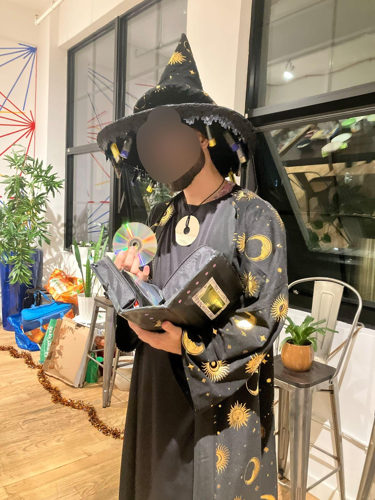
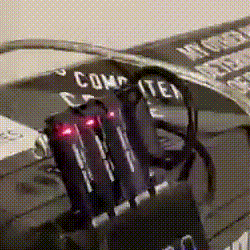
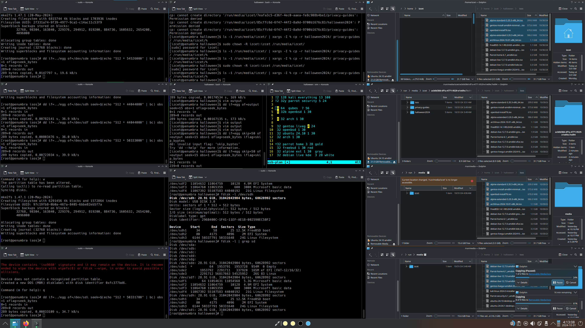
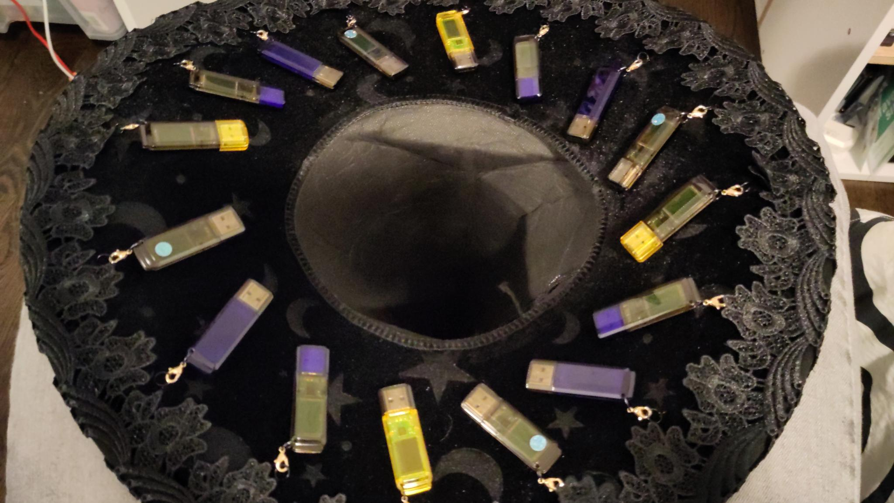

# Installation Wizard Costume

This was my costume for Halloween in 2024. In addition to the aesthetic punnery, I also had numerous technical bits, such as:
- linux installation and live disk USBs on my hat
- digitally corrupted DVDs
- mildly to moderately cursed mix CDs
- "is this your card?" magic trick decks and microSD gags

I won first place in the tech-themed "recursed" [Recurse Center](https://www.recurse.com/) costume contest.

This repo documents the tools I used and scripts I wrote as part of this project.

### Special Thanks
##### Costume assembly:
- Amanda H
- Lewis
- Ngina K 
- Victoria L
- and many more at NYC Resistor

##### Technical support:
- Boris V
- Catharine M
- Chris R

##### Musical support:
- Amy P
- Mansi S

### Expected Vs Actual
I originally wanted to create a multiboot USB so that all the drives could have the same image, and at runtime select which version of linux to install. I used [aguslr/multibootusb](https://github.com/aguslr/multibootusb) as reference, but opted to rewrite the `grub.cfg` myself rather than "run this shell script as root". I ultimately didn't have enough time to put that part of the project together, running up to the wire (5am Halloween morning!) burning the last of the USBs. I've since shelved that project, and may finish it independently at another time. I've saved the relevant progress here. 

What I opted to instead was to have different single distros per drive, and color-code them. I also overwrote the ISO partition tables to add an extra partition after the installer to use the remaining space on the USB. On the bonus partition I included this repo at [the state it was Oct 30th](https://github.com/izcet/halloween2024/tree/8a9a51566d996483aff84088973a27d337548e61), offline archives of [PrivacyGuides Recommendations](https://www.privacyguides.org/en/tools/), and the other different Linux or BSD images that didn't get burned. I also included an easter egg somewhere on the disk outside the partitions in empty space, if anyone got one of these and wants a small forensics challenge. I also distributed the checksums of the ISOs that were burned, however that was moot because the extra partition changes the actual bytes written. oops.

This is what my computer looked like for the better part of two days.

All in all I burned 24 USBs, with burning being doubly accurate since they would come out of my machine sometimes too hot to handle. Anywhere between 1 to 8 of a given drive would have identical contents, and I ended up with 16 on the hat and 8 in the "spellbook" prop, and gave away about a dozen in total over the course of two parties.

And the on-screen process looked like this. The center column was for ad-hoc commands and searching, the left and right columns tracked the drive construction progress in 4 rows, with a given row corresponding to a specific drive in the hub.

Yes I had multiple instances of Konsole running, I hadn't gotten used to tmux ok don't @ me.

### Physical costume parts:
- Abracadabra NYC [Celestial Wizard](https://abracadabranyc.com/products/celestial-wizard-robe?_pos=1&_sid=46905e6bd&_ss=r?variant=39636226965666)
- Abracadabra NYC [Moonstar Witch Hat](https://abracadabranyc.com/products/moonstar-witch-hat-w-bow). I removed the bow, and crafted loops from wire and keychain assembly parts to hang the USBs. 
- Micro Center [CD Binder](https://www.microcenter.com/product/202530/case-logic-heavy-duty-eva-black-cd-wallet). The link doesn't go to the exact model, which is available in store but not listed on their website.
- Various CDs, DVDs, USBs.
- One dead hard drive platter for the necklace.

